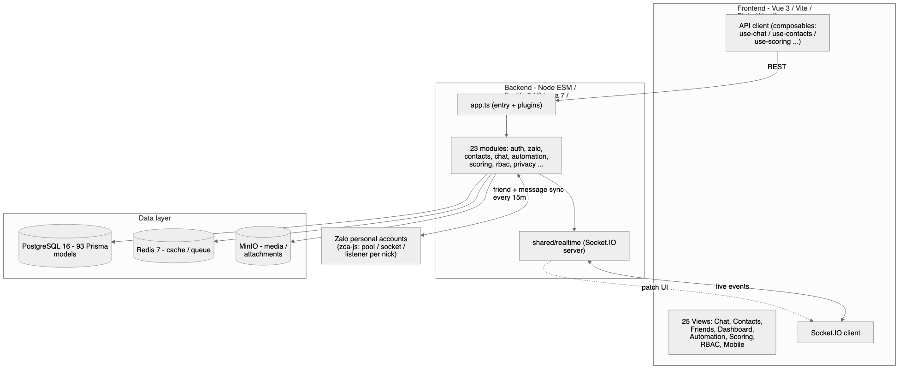
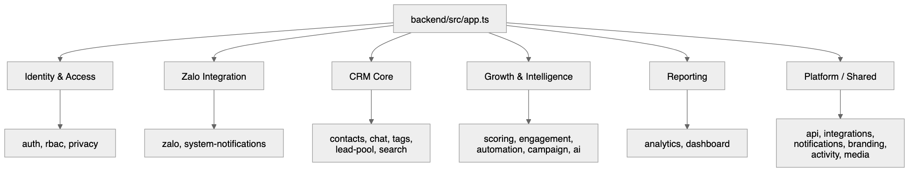
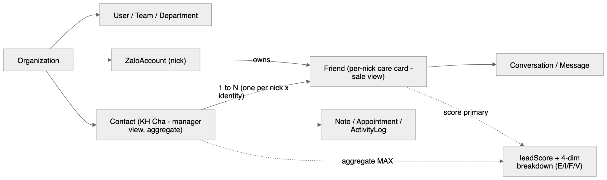
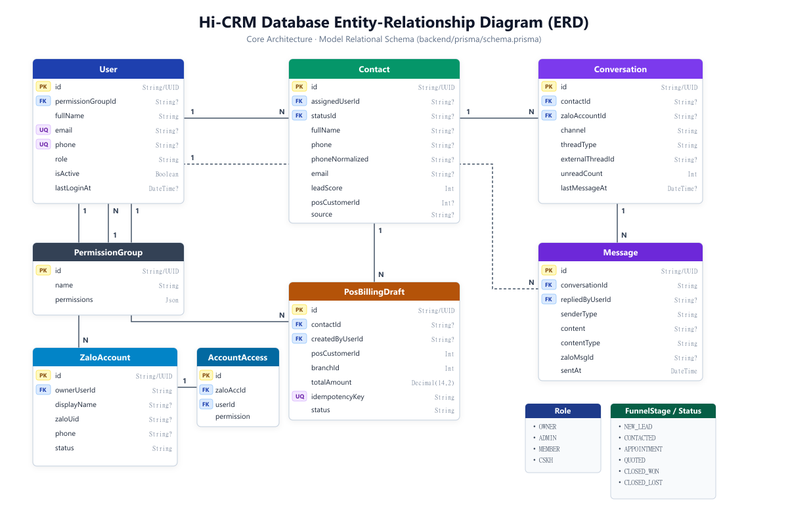

# Kiến trúc code Hi-CRM

Sơ đồ kiến trúc của Hi-CRM (CRM quản lý nhiều nick Zalo cá nhân trên 1 web app), tạo ngày **2026-06-16** bằng `/diagram`.

Mỗi sơ đồ có bộ 3 file:
- `.mmd` — nguồn Mermaid (sửa file này rồi re-render là cách cập nhật chuẩn).
- `.excalidraw` — mở tại [excalidraw.com](https://excalidraw.com) (File → Open) để kéo-thả, sửa tay.
- `.svg` / `.png` — ảnh vector + raster để nhúng vào docs/chat.

> Đối chiếu với code thật ngày 2026-06-16: backend **23 module**, frontend **25 views** (+ automation/rbac/settings), Prisma **93 model**, entry `backend/src/app.ts`, realtime `backend/src/shared/realtime`.

---

## 1. Kiến trúc tổng thể

- **Frontend** (Vue 3 + Vite + Pinia + Vuetify): 25 views, gọi backend qua REST (composables `use-*`) và nhận patch realtime qua Socket.IO client.
- **Backend** (Node ESM + Fastify 5 + Prisma 7): entry `app.ts` → 23 module nghiệp vụ → ghi DB và phát event qua `shared/realtime`.
- **Data layer**: PostgreSQL 16 (93 model) + Redis 7 (cache/queue) + MinIO (media/attachment).
- **Zalo**: tích hợp `zca-js` — pool/socket/listener theo từng nick; đồng bộ friend + tin nhắn định kỳ ~15 phút, tuần tự per-account để tránh rate-limit.

## 2. Bản đồ 23 module backend

| Nhóm | Module |
|---|---|
| Identity & Access | `auth`, `rbac`, `privacy` |
| Zalo Integration | `zalo`, `system-notifications` |
| CRM Core | `contacts`, `chat`, `tags`, `lead-pool`, `search` |
| Growth & Intelligence | `scoring`, `engagement`, `automation`, `campaign`, `ai` |
| Reporting | `analytics`, `dashboard` |
| Platform / Shared | `api`, `integrations`, `notifications`, `branding`, `activity`, `media` |

## 3. Mô hình dữ liệu gốc — Contact vs Friend

Quyết định gốc: mô hình **"2 cuốn sổ"**.
- **`Contact`** = KH Cha, góc nhìn manager/danh sách/dashboard — lưu thuộc tính con người + aggregate (score/status/counter cache). KH Cha hiển thị = `contacts WHERE merged_into IS NULL`.
- **`Friend`** = phiếu chăm sóc con, góc nhìn sale/nick — mỗi row là 1 cặp `zaloAccount × identity`; lưu UID/tên/alias/labels/relationship per-nick.
- 1 Contact → N Friend. **Score chính nằm ở Friend**; `Contact.leadScore` là aggregate (MAX) theo thiết kế. Breakdown 4 chiều: Engagement / Intent / Fit / Velocity.
- `relationship_kind` hợp lệ: `friend` / `pending_friend` / `chatting_stranger` / `ghost` (giá trị `none` là rác → FE ép thành `chatting_stranger`, render màu xanh).

---

### Cập nhật sơ đồ
Sửa file `.mmd` tương ứng rồi chạy lại `/diagram` (re-render từ nguồn). Hoặc sửa `.excalidraw` trên excalidraw.com rồi re-render từ scene đã sửa.

---

## 4. Sơ đồ Quan hệ Thực thể ERD (Database Relational Models - Mục 4.2)

Dành riêng cho báo cáo kỹ thuật / luận văn (khớp sát cấu trúc `schema.prisma` và đoạn mô tả 4.2):

### 4.2.1. Sơ đồ Cốt lõi (Core ERD - Đề xuất chèn báo cáo chính)

> **File nguồn:** [erd-core.svg](./erd-core.svg) (vector), [erd-core.png](./erd-core.png) (300 DPI), [erd-core.mmd](./erd-core.mmd) (Mermaid).

### 4.2.2. Các tiểu sơ đồ phân hệ (Sub-domain ERDs)
1. **Multi-tenant RBAC & Phân quyền:** [erd-sub-rbac.png](./erd-sub-rbac.png) | [erd-sub-rbac.svg](./erd-sub-rbac.svg)
2. **Customer 360 & Chăm sóc Zalo (Two-ledger):** [erd-sub-care-chat.png](./erd-sub-care-chat.png) | [erd-sub-care-chat.svg](./erd-sub-care-chat.svg)
3. **Đồng bộ POS Read-models & Tồn kho:** [erd-sub-pos-sync.png](./erd-sub-pos-sync.png) | [erd-sub-pos-sync.svg](./erd-sub-pos-sync.svg)

👉 **Xem trực quan toàn bộ tại:** [erd-hub.html](./erd-hub.html)

